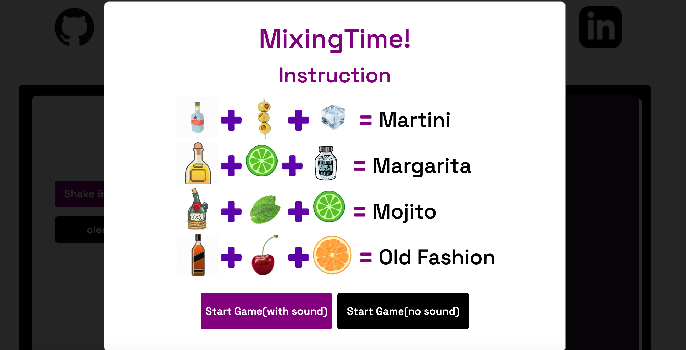

# [Mixing Time](https://alvinc90.github.io/mixing-time//)

## Description
Mixing Time is a drink matching game where the player assumes the roll of a bartender, simulating a busy Friday night life as a bartender. Learn to mix real cocktail recipes and serve delicious beverage to multiple customers at once. Earn tips(High Scores) on the leaderboard.

## Architecture & Technologies 
* Vanilla JavaScript
* HTML5
* CSS3

## Functionality & MVP
- [ ] Start, pause and reset the game
- [ ] Instruction modal serves as pause game and to read recipes.
- [ ] Use the mouse to select cocktail ingredient.
- [ ] Make tips by correctly mixing the ingredient. 
- [ ] Receive a strike on the performance bar if customer is left unserved for more than 10 seconds. 
- [ ] Mixing drinks incorrectly will also result in a strike that effects the performance bar.
- [ ] Fired from work aka "Lose the game" if receive 3 strikes.

## Features 
### Instruction Modal/Startgame 

## Implementation Timeline
### Day 1: 
   * setup wiki & wireframe
   * setup basic skeleton of project e.g. webpack and entry file
   * review Vanilla JavaScript

### Day2:
   * Finalizing the shell/skeleton of the game 
   * Adding functionality 
   * Adding design 

### Day3: 
   * working on timer bug

### Day4: 
   * Finishing touches/ seeding images

### Day5: 
   * Final debug/ final image seeding/ do the readme
